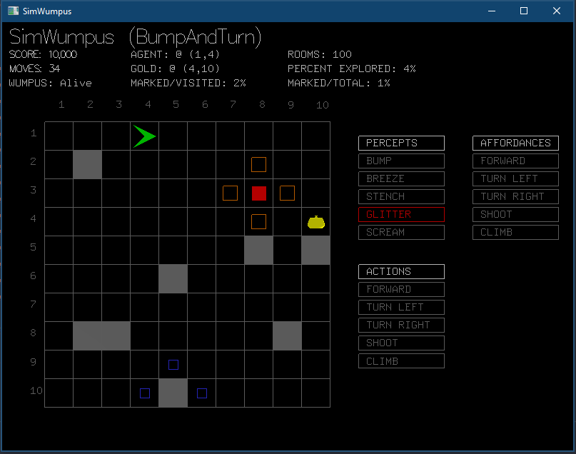
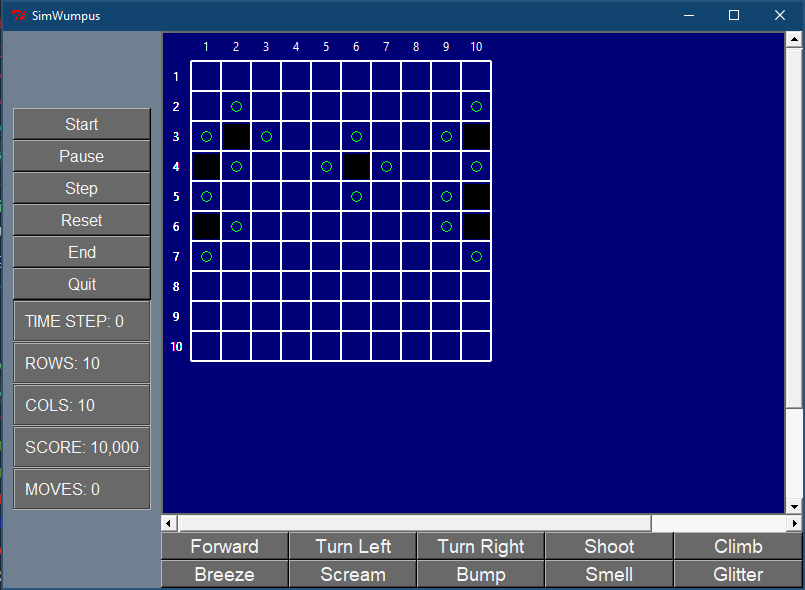

# Wumpus
A small unfinished hunt the wumpus agent game/simulation
I wrote many years ago in Python as a student.

There is also the beginnings of an (incomplete) formal specification
of the wumpus world game written in the Z formal specification language.
You can find a PDF of this document here:

- [Incomplete Wumpus World Formal Z Specification (PDF)](https://github.com/mikepsn/wumpus/blob/master/zspec/wumpus.pdf)

I wrote this code back in early 2002 using (I think) Python 2.3
as a graduate student. It was supposed to be a simple Wumpus world 
agent environment for conducting research into affordance theory.
Also the basics are there, it is largely unfinished as I moved on to other
domain at the time.

What is suprising is that after all these years (2018) the code still
runs under Python 2.7. I tested it using the Anaconda distribution under
Mac OS X and Windows 10.

The visualisation code requires PyOpenGL and the Python bindings for GLUT. 
If you have any problems with GLUT under Anaconda you can try installing
the Python bindings to the `freeglut` library using `conda` as follows:

    conda install -c conda-forge freeglut

As I mentioned the code was written in early 2002 before I adopted a PEP8
compliant coding style. I've long since abandoned the horrible CamelCase
coding style in my code, but I guess its probably not worth changing this code.

Unfortunately there is also a mix of tabs and spaces. The code works but
a move to all spaces and a PEP8 compliant format would be nice.

I don't have any immediate plans to continue developing this, but if at some 
stage in the future I do decide to revisit it, setting up an interface
to OpenAI gym might be the way to go. That way it can be provided to
students to try out different reinforcement learning algorithms (or
other agent approaches).

The code can be run as follows:

    python simwumpus.py

I had also developed two GUIs for the simulation. The first one is an PyOpenGL 
based visualisation. Once loaded you can click the mouse anywhere in
the window to tick the game. The simulation generates random wumpus world maps.
The default agent just travels in a straight line 
(only turning if it bumbps into a wall). If the hunter falls into a pit,
he dies and the simulation is reset. To run the PyOpenGL based GUI:

    python glgui.py

There is also an incomplete Tk based UI. It doesn't really do anything, but
you can run it and display it as follows:

    python gui.py

Finally, there is a small template for creating your own PyOpenGL/GLUT 
applications which just shows a spinning teapot. 
You can run it as follows:

    python gltemplate.py

As mentioned, this code is an incomplete prototype. If I ever continue
developing this, this would be my to do list:

- [ ] Switch to all space based formatting.
- [ ] Reformat to be PEP8 compliant.
- [ ] Run it through a linter like flake8 or a formatter like black.
- [ ] Replacee custom boolean type with Python built in type.
- [ ] Port it to Python 3.6.
- [ ] Make it a proper Python module installable using pip
- [ ] Write tests using PyTest and link it up to CI.
- [ ] Generate documentation and put it up on readthedocs.
- [ ] Create a new Jupyter ipythonwidgets based interface.
- [ ] Create an interface to OpenAI Gym.
- [ ] Write a reinforcement learning hunter agent to play the game.

Looking over this code from 2002, these days it can be written
much more efficently and compactly if you use modern approaches 
like a numpy array to represent the grid as well list/dictionary comprehensions.

- MP, May 2018. 